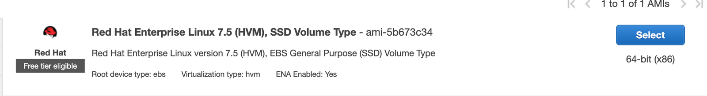

# Running Red Hat Enterprise Linux 7.5 as EKS Worker Nodes

## Setup
* Red Hat Enterprise Linux 7.5


* Kubernetes 1.12.7 on AWS EKS

## Workflow
* Provision an EC2 Server with RHEL 7.5 AMI.
* Install the following dependencies.
```
yum install -y git vim
yum install -y https://dl.fedoraproject.org/pub/epel/epel-release-latest-7.noarch.rpm
yum install -y python-pip
pip install --upgrade awscli
yum install -y http://mirror.centos.org/centos/7/extras/x86_64/Packages/container-selinux-2.68-1.el7.noarch.rpm
```
* Clone this repo and Execute install-worker.sh
```
git clone https://github.com/piu28/aws-eks-rhel-workers.git
cd aws-eks-rhel-workers
sh install-worker.sh
```
* Create an AMI of this server.
* Provision a Cloudformation Stack with the below template provided by AWS:
```
https://amazon-eks.s3-us-west-2.amazonaws.com/cloudformation/2019-02-11/amazon-eks-nodegroup.yaml
```
* In the parameter "NodeImageId", input the Image ID of the AMI created in the previous step.
